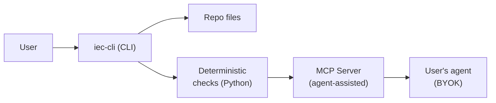

# iec-cli Architecture

iec-cli is a Python CLI tool that validates Intent Engineering practices in any repository. It has two layers of checks: deterministic (runs without an agent) and agent-assisted (via MCP, using the user's own coding agent).

## Design



## Two-Layer Check Architecture

| Layer | Technology | What it checks |
|---|---|---|
| Deterministic | Pure Python | File size, structure, MADR format, AC ID patterns, test markers, secrets |
| agent-assisted | MCP server | Top-heavy content, ADR scope, AGENTS.md TOC quality, spec semantics |

The deterministic layer works on any machine — no agent required. The agent layer starts an MCP server. The user's coding agent connects and runs semantic checks. BYOK: the user brings their own coding agent.

## Commands

```
iec --help                # Show usage
iec --version             # Show version

iec init                  # Scaffold canonical Intent Engineering directory structure
iec init --path <dir>     # Target a specific directory
iec init --dry-run        # Preview what would be created
iec init --force           # Overwrite existing files
iec init --with-claude    # Also emit CLAUDE.md with @AGENTS.md import
iec init --with-gemini    # Also emit .gemini/settings.json context config

iec check                 # Run deterministic checks only (future)
iec check --all           # Run deterministic + agent-assisted (future)
iec check --path src/     # Scope to a directory or file (future)

iec generate              # Emit vendor agent instruction files (future)
```

## Technology Stack

| Concern | Choice | Why |
|---|---|---|
| Language | Python 3.12+ | Universal, readable, mature CLI ecosystem |
| CLI framework | Typer | Type-hint driven, fast to develop |
| Package manager | uv | Single tool for Python + packages |
| Agent bridge | MCP (modelcontextprotocol.io) | BYOK, agent-agnostic |
| Lint/format | ruff | Fast, comprehensive |
| Test | pytest | Standard, well-supported |

## Repository Map

See [INDEX.md](INDEX.md) for the agent-facing map of all documentation.
